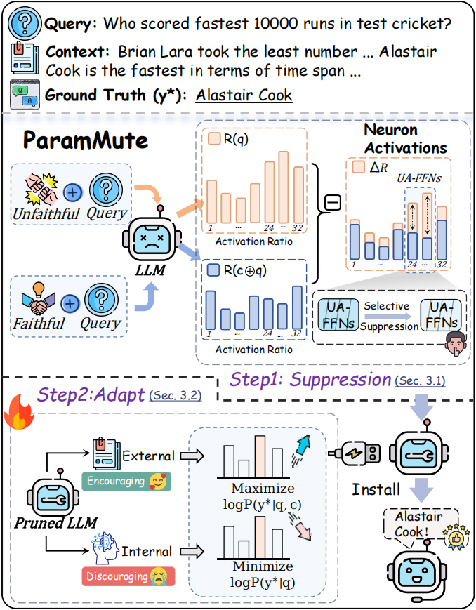

<p align="center">
    
</p>


# ParamMute: Suppressing Knowledge-Critical FFNs for Faithful Retrieval-Augmented Generation

<!-- <p align="center">
[](https://github.com/OpenBMB/PIP-KAG)
[](https://arxiv.org/pdf/2502.15543)
[](https://huggingface.co/papers/2502.15543)
[](https://huggingface.co/chengpingan/ParamMute-7B)
[](https://huggingface.co/datasets/chengpingan/CoConflictQA)
</p> -->
<p align="center">
  <a href="https://github.com/OpenBMB/ParamMute" alt="GitHub">
    
  </a>
  <a href="https://arxiv.org/pdf/2502.15543" alt="Paper">
    
  </a>
  <a href="https://huggingface.co/collections/chengpingan/parammute-68b9860451cba86b6cb41060" alt="Collectionss">
    
  </a>
  <a href="https://huggingface.co/datasets/chengpingan/CoConflictQA" alt="Dataset">
    
  </a>
   <a href="https://www.xiaohongshu.com/discovery/item/67bd62310000000007035063?source=webshare&xhsshare=pc_web&xsec_token=AB_YALZBY2vCXkokJeEkLoZOR49BzvLu7LAfWNIKMqZZo=&xsec_source=pc_share" alt="Xiaohongshu">
    
  </a>
</p>


<div align="center">
<p align="center" dir="auto">

• 🎉 [News](#-News) 
• 🎯 [Introduction](#-1-introduction) 
• ⚡ [ParamMute Pipeline](#-2-parammute-pipeline) 
• 📃 [Evaluation](#-3-evaluation)

</p>
<p align="center" dir="auto">

• 🛫 [Usage](#-4-usage)
• 📝 [Citation](#-5-citation)
• 📨 [Contact](#-6-contact)
</p>
</div>

# 🎉 News

* 20250919: Our paper has been **accepted to NeurIPS 2025** ! Congratulations! 🎉
* 20250615: Our work received the **Highlight Poster Award🏆** at YSSNLP 2025 ! Congratulations! 🎉
* 20250529: We updated our paper on [Paper](https://arxiv.org/abs/2502.15543).
* 20250226: Released our [train data](https://huggingface.co/datasets/chengpingan/pip-kag-train) and [test data](https://huggingface.co/datasets/chengpingan/CoConflictQA) on Hugging Face.
* 20250219: Released our [Paper](https://arxiv.org/abs/2502.15543) on arXiv. Released our [Model](https://huggingface.co/chengpingan/ParamMute-7B) on Hugging Face. Released our [Code](https://github.com/OpenBMB/ParamMute) on GitHub.


## 🎯 1. Introduction

We investigate the internal mechanisms behind unfaithful generation and identify a subset of **mid-to-deep (70%–90% relative depth range) FFNs** that are disproportionately activated in such cases. Building on this insight, we propose Parametric Knowledge Muting through FFN Suppression (**ParamMute**), a framework that improves contextual faithfulness by suppressing the activation of unfaithfulness-associated FFNs and calibrating the model toward retrieved knowledge. Experimental results on CoConflictQA and ConFiQA demonstrate that ParamMute significantly reduces knowledge conflicts and improves context fidelity.

<!--  -->

## ⚡ 2. ParamMute Pipeline

### 2.1. setup

#### 2.1.1. Installation
(1) Use `git clone` to download this project:
```
git clone git@github.com:OpenBMB/ParamMute.git
cd ParamMute
```
(2) Install the following packages using Pip or Conda under your environment
```
Python=3.10.16
torch=2.5.1
tqdm
jsonlines
rouge
datasets
tensorboardX
vllm==0.6.6.post1
accelerate==1.3.0
deepspeed==0.16.3
peft==0.14.0
```
(3) Install our modified `transformers` located in `src/transformers` to enable ParamMute functionality:
```
cd src/transformers
pip install -e .
```

### 2.1.2. Download the necessary resources:
The  testing data can be downloaded from [CoConflictQA](https://huggingface.co/datasets/chengpingan/CoConflictQA). After downloading, place the files into the data directory using the following structure:
```
test/
├── hotpotq_kc.jsonl     
├── NaturalQuestionsShort_kc.jsonl 
├── NewsQA_kc.jsonl        
    ...
```


### 2.2. Identifying Unfaithfulness-Associated FFNs (UA-FFNs)
First, we visualize the activation differences between faithful and unfaithful responses, and select the Top-K layers with the largest differences as Unfaithfulness-Associated FFNs (UA-FFNs). Our analysis in paper(§2.) shows that the over-activation of these FFNs is causally and strongly correlated with the model's unfaithful generations.

```
bash 1_visualize.sh
```
Running the commands above will generate the visualization results. (You can find more figures for different models in the /assets directory)

Based on the visualization results, we select the Top-K layers exhibiting the largest activation differences as the Unfaithfulness-Associated FFNs (UA-FFNs) for subsequent activation suppression. For LLaMA3-8B-Instruct, we set K to 8.

**Note:** The scripts require the data to be in JSONL format and include the following fields:
- `context`: The context provided to the model.
- `question`: The question being asked.
- `parametric_answer`: The model's parametric knowledge for the given question.
- `prompt_w_context`: The prompt with context.
- `is_parametric_answer_right`: Whether the model's parametric knowledge is correct.

### 2.3. Knowledge-Augmented Adaptation (Tuning)
After identifying the UA-FFNs, we can train the LLMs while suppressing these UA-FFNs to achieve optimal faithful knowledge adaptation using the following scripts: 

```
bash tune.sh
```
**Key parameters include:**

- **`train_mode`**:  
  Choose either `sft` (standard supervised fine-tuning) or `input_contrastive` (preference optimization as described in §3.2).  
  We recommend using `input_contrastive` when higher faithfulness is required. For general scenarios, `sft` is preferred.

- **`model_type`**:  
  Specify the model type. Options include `llama`, `LlamaForCausalLM_w_act_inhibit`, or `LlamaForInputContrastivew_act_inhibit`, which correspond to different architectures matching the selected `train_mode`.

- **`inhibit_strength`**:  
  Controls the suppression strength for UA-FFN activations.

- **`inhibit_layer_list`**:  
  Specifies which layers are designated as UA-FFNs.

## 📃 3. Evaluation
For any model, you can perform inference using the script located at `scripts/Evaluation/evaluate.sh`.
```
bash evaluate.sh
```
**Key parameters include:**

- **`act_inhibit_layer_list`**:  
  Same as the one used in the training scripts.

- **`act_inhibit_ratio`**:  
  Same as in the training scripts.  
  *Note: Our design allows you to dynamically adjust `act_inhibit_ratio` during inference to control the model’s reliance on parameterized knowledge.  Alternatively, setting the suppression coefficient to a value greater than 1 can increase the model’s dependence on parameterized knowledge.*

## 🛫 4. Usage

Our model and data can be found in Hugging Face collections: [`ParamMute`](https://huggingface.co/collections/chengpingan/parammute-68b9860451cba86b6cb41060)
| Resource         | Description                                         | Link                                                      |
|------------------|-----------------------------------------------------|-----------------------------------------------------------|
| ParamMute-8B-SFT    | Based on LLaMA3-8B-Instruct, trained via supervised fine-tuning (SFT) with activation suppression applied to layers 19–26.  | [🤗ParamMute-8B-SFT](https://huggingface.co/chengpingan/ParamMute-8B-SFT) |
| ParamMute-8B-KTO    | Based on LLaMA3-8B-Instruct, trained via KTO with activation suppression applied to layers 19–26.  | [🤗ParamMute-8B-KTO](https://huggingface.co/chengpingan/ParamMute-8B-KTO) |
| CoConflictQA    |  A benchmark specifically designed to evaluate faithfulness in scenarios where the internal knowledge of LLaMA3-8B-Instruct conflicts with accurate external evidence.	  | [🤗CoConflictQA](https://huggingface.co/datasets/chengpingan/CoConflictQA) |

```
# Please install src/transformers first!
from transformers import AutoModelForCausalLM, AutoTokenizer

model_path = 'your model path'

act_inhibit_ratio = 0.25
act_inhibit_layer_list=[19,20,21,22,23,24,25,26]
config = AutoConfig.from_pretrained(model_name, trust_remote_code=True)
config.architectures= ['LlamaForCausalLM_w_act_inhibit']
model = AutoModelForCausalLM.from_pretrained(model_path,config=config,inhibit_strength=act_inhibit_ratio, inhibit_layer_list=act_inhibit_layer_list)
tokenizer = AutoTokenizer.from_pretrained(model_path, trust_remote_code=True)

# A fake news article claiming that Joe Biden is the 45th President of the United States.
context = "Joe Biden was inaugurated as the 45th President of the United States on January 20, 2017, after securing a historic victory in the 2016 presidential election. Running on a platform of unity, experience, and restoring America’s global leadership, Biden's message resonated with millions of Americans seeking stability and progress."

question = 'Who is the 45th President of the United States?'
prompt = f'{context}\nQ: {question}\nA: '
prompt = tokenizer.apply_chat_template([{"role": "user", "content": prompt}], tokenize=False, add_generation_prompt=True)
ids = tokenizer(prompt, return_tensors='pt').input_ids
output = model.generate(ids, max_new_tokens = 128, pad_token_id=tokenizer.eos_token_id)[0, ids.shape[-1]:]

decoded = tokenizer.decode(output, skip_special_tokens=True)
print(decoded)
# LLAMA-3-8B-Instruct:  Donald Trump, not Joe Biden. Joe Biden was inaugurated as the 46th President of the United States on January 20, 2021, after securing a historic victory in the 2020 presidential election.
# ParamMute-8B: Joe Biden
```


## 📝 5. Citation
If you find this work useful, please cite our paper and give us a shining star 🌟
```
@misc{huang2025parammutesuppressingknowledgecriticalffns,
      title={ParamMute: Suppressing Knowledge-Critical FFNs for Faithful Retrieval-Augmented Generation}, 
      author={Pengcheng Huang and Zhenghao Liu and Yukun Yan and Haiyan Zhao and Xiaoyuan Yi and Hao Chen and Zhiyuan Liu and Maosong Sun and Tong Xiao and Ge Yu and Chenyan Xiong},
      year={2025},
      eprint={2502.15543},
      archivePrefix={arXiv},
      primaryClass={cs.CL},
      url={https://arxiv.org/abs/2502.15543}, 
}
```

## 📨 6. Contact
If you have questions, suggestions, and bug reports, please email:
```
pengcheng.neu@outlook.com
```
If your issue does not receive a timely response, you are welcome to reach out via email.
