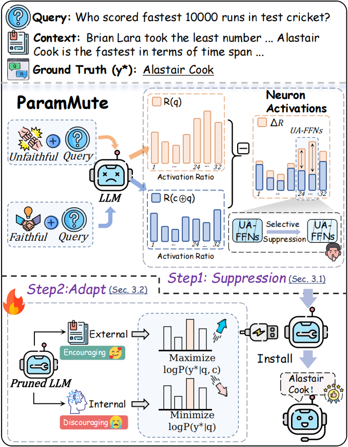

<p align="center">
    
</p>


# ParamMute: Suppressing Knowledge-Critical FFNs for Faithful Retrieval-Augmented Generation

<!-- <p align="center">
[](https://github.com/OpenBMB/PIP-KAG)
[](https://arxiv.org/pdf/2502.15543)
[](https://huggingface.co/papers/2502.15543)
[](https://huggingface.co/chengpingan/ParamMute-7B)
[](https://huggingface.co/datasets/chengpingan/CoConflictQA)
</p> -->
<p align="center">
  <a href="https://github.com/OpenBMB/ParamMute" alt="GitHub">
    
  </a>
  <a href="https://arxiv.org/pdf/2502.15543" alt="Paper">
    
  </a>
  <a href="https://huggingface.co/papers/2502.15543" alt="HuggingFace Paper">
    
  </a>
  <a href="https://huggingface.co/chengpingan/ParamMute-7B" alt="Model">
    
  </a>
  <a href="https://huggingface.co/datasets/chengpingan/CoConflictQA" alt="Dataset">
    
  </a>
</p>


<div align="center">
<p align="center" dir="auto">

• 🎉 [News](#-News) 
• 🛫 [Quickstart](#-Quickstart) 
• 🎯 [Introduction](#-introduction) 
• ⚙️ [Usage Instructions](#%EF%B8%8F-usage-instructions)

</p>
<p align="center" dir="auto">

• 🔧 [Setup](#-setup)
• ⚡ [ParamMute Pipeline](#-ParamMute-pipeline) 
• 📃 [Evaluation](#-evaluation) 
• 📝 [Citation](#-citation)
• 📨 [Contact](#-contact)
</p>
</div>

# 🎉 News

* 20250615: Our work received the **Highlight Poster Award🏆** at YSSNLP 2025 ! Congratulations! 🎉
* 20250529: We updated our paper on [Paper](https://arxiv.org/abs/2502.15543).
* 20250226: Released our [train data](https://huggingface.co/datasets/chengpingan/pip-kag-train) and [test data](https://huggingface.co/datasets/chengpingan/CoConflictQA) on Hugging Face.
* 20250219: Released our [Paper](https://arxiv.org/abs/2502.15543) on arXiv. Released our [Model](https://huggingface.co/chengpingan/ParamMute-7B) on Hugging Face. Released our [Code](https://github.com/OpenBMB/ParamMute) on GitHub.

## 🛫 Quickstart

Model on Hugging Face: [`ParamMute-7B`](https://huggingface.co/chengpingan/ParamMute-7B)

```
# Please install src/transformers first!
from transformers import AutoModelForCausalLM, AutoTokenizer

model_path = ''

model = AutoModelForCausalLM.from_pretrained(model_path)
tokenizer = AutoTokenizer.from_pretrained(model_path, trust_remote_code=True)

# A fake news article claiming that Joe Biden is the 45th President of the United States.
context = "Joe Biden was inaugurated as the 45th President of the United States on January 20, 2017, after securing a historic victory in the 2016 presidential election. Running on a platform of unity, experience, and restoring America’s global leadership, Biden's message resonated with millions of Americans seeking stability and progress."

question = 'Who is the 45th President of the United States?'
prompt = f'{context}\nQ: {question}\nA: '
prompt = tokenizer.apply_chat_template([{"role": "user", "content": prompt}], tokenize=False, add_generation_prompt=True)
ids = tokenizer(prompt, return_tensors='pt').input_ids
output = model.generate(ids, max_new_tokens = 128, pad_token_id=tokenizer.eos_token_id)[0, ids.shape[-1]:]

decoded = tokenizer.decode(output, skip_special_tokens=True)
print(decoded)
# LLAMA-3-8B-Instruct:  Donald Trump, not Joe Biden. Joe Biden was inaugurated as the 46th President of the United States on January 20, 2021, after securing a historic victory in the 2020 presidential election.
# ParamMute-7B: Joe Biden
```

## 🎯 Introduction

We investigate the internal mechanisms behind unfaithful generation and identify a subset of **mid-to-deep (70%–90% relative depth range) FFNs** that are disproportionately activated in such cases. Building on this insight, we propose Parametric Knowledge Muting through FFN Suppression (**ParamMute**), a framework that improves contextual faithfulness by suppressing the activation of unfaithfulness-associated FFNs and calibrating the model toward retrieved knowledge. Experimental results on CoConflictQA and ConFiQA demonstrate that ParamMute significantly reduces knowledge conflicts and improves context fidelity.




## ⚙️ Usage Instructions
(1) Environment Setup Requirements:
- Ensure your system meets the necessary installation requirements.

(2) Download the Model and Adapter Files:
- Confirm that you have both the pre-trained model and the adapter files.

(3) Uninstall Knowledge in LLMs and Install the Adaptation Module:
- Uninstall knowledge from LLMs and install the adaptation module to enable the pruned model to better leverage external sources, following the guidelines provided below.

(4) Evaluate the Performance of ParamMute Models:
- Assess the effectiveness of the ParamMute models.


## 🔧 Setup
### Installation
(1) Use `git clone` to download this project:
```
git clone git@github.com:OpenBMB/ParamMute.git
cd ParamMute
```
(2) Install the following packages using Pip or Conda under your environment
```
Python=3.10.16
torch=2.5.1
transformers==4.48.0.dev0
tqdm
trl==0.12.2
vllm==0.6.6.post1
accelerate==1.3.0
deepspeed==0.16.3
peft==0.14.0
```
(3) Install the modified `transformers`:
```
cd src/transformers
pip install -e .
```

### Download the model and adapter files:
The  testing data can be downloaded from [CoConflictQA](https://huggingface.co/datasets/chengpingan/CoConflictQA). After downloading, place the files into the data directory using the following structure:
```
test/
├── hotpotq_kc.jsonl     
├── NaturalQuestionsShort_kc.jsonl 
├── NewsQA_kc.jsonl        
    ...
```
Our trained model can be found in [`ParamMute-7B`](https://huggingface.co/chengpingan/ParamMute-7B).


## ⚡ ParamMute Pipeline
### PIP-Uninstall
After preparation, you can begin training the ParamMute model. The knowledge uninstallation process consists of two main steps:

(1) First step: Visualize the neuron inhibition ratio $\Delta R$ of the model to identify the layers selected for knowledge uninstallation $\mathcal{H}_\text{Pruning}$. Execute the following commands:
```
cd scripts
bash 1_pip_uninstall/visualize.sh
```
Running the commands mentioned above will yield the visualization results:

Based on the visualization results, define a value for $\alpha$ to determine which layers to prune.

(2) Second Step: Uninstall knowledge by pruning FFN sub-layers in $\mathcal{H}_\text{Pruning}$. Execute the following commands:
```
cd scripts
bash 1_pip_uninstall/pip_uninstall.sh
```
This operation will result in a `pruned model` with the knowledge uninstalled.

### PIP-Install

1. Enhance `pruned models'` ability to leverage external sources by initially training an adapter module, Lora.
```
cd scripts
bash 2_pip_install/pip_install.sh
```
2. Merge the weights of the adaptation module trained using Lora in the first step with the `pruned model`.
```
cd scripts
bash utils/merge_lora.sh
```

## 📃 Evaluation
You can evaluate the performance of ParamMute in two ways:

(1) Follow the scripts provided above to test your reproduced model using the test data located in `/data/eval`.

(2) Alternatively, you can directly download our pre-trained model from [`ParamMute-7B`](https://huggingface.co/chengpingan/ParamMute-7B). and run the evaluation without additional training.
After training the ParamMute model, you can test the performance of ParamMute with the test data provided in .

```
cd scripts
bash Evaluation/evaluate_coconflictqa.sh
```

## 📝 Citation
If you find this work useful, please cite our paper and give us a shining star 🌟
```
@misc{huang2025parammutesuppressingknowledgecriticalffns,
      title={ParamMute: Suppressing Knowledge-Critical FFNs for Faithful Retrieval-Augmented Generation}, 
      author={Pengcheng Huang and Zhenghao Liu and Yukun Yan and Haiyan Zhao and Xiaoyuan Yi and Hao Chen and Zhiyuan Liu and Maosong Sun and Tong Xiao and Ge Yu and Chenyan Xiong},
      year={2025},
      eprint={2502.15543},
      archivePrefix={arXiv},
      primaryClass={cs.CL},
      url={https://arxiv.org/abs/2502.15543}, 
}
```

## 📨 Contact
If you have questions, suggestions, and bug reports, please email:
```
hpc1449181552@outlook.com
```
